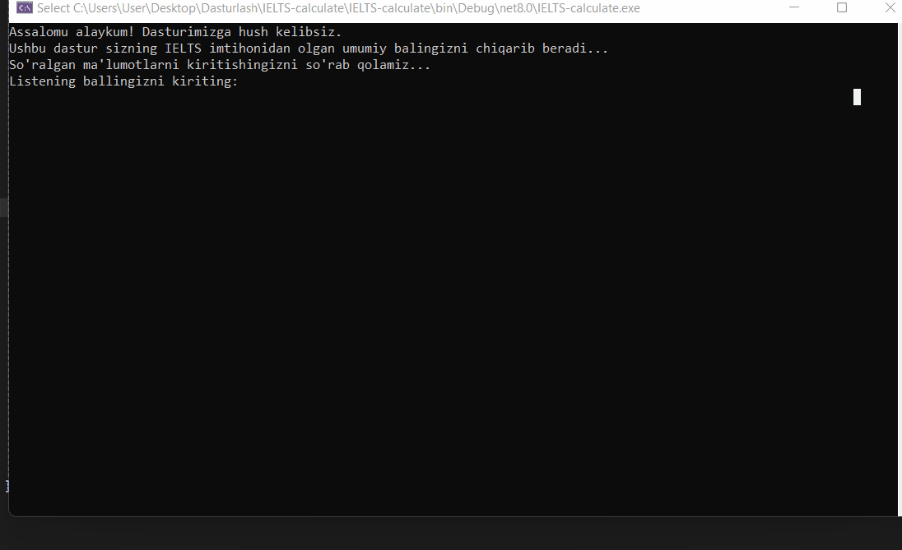

# 🎓 IELTS Calculator (Console Application)

**IELTS Calculator** — bu C# tilida yozilgan konsol dastur bo‘lib, foydalanuvchining IELTS imtihonidagi to‘rtta modul ballari asosida **Overall Band Score** ni avtomatik hisoblab beradi.

---
## 🎬 Demo (How the app works)

  

## 📌 Loyihaning vazifasi

Dastur foydalanuvchidan quyidagi IELTS modullari bo‘yicha ballarni qabul qiladi:

- 🎧 Listening  
- 📖 Reading  
- ✍️ Writing  
- 🗣 Speaking  

Shundan so‘ng IELTS qoidalariga mos ravishda **umumiy (Overall) ball** ni hisoblab, konsolga chiqaradi.

---

## ⚙️ Ishlash prinsipi

1. Foydalanuvchi 4 ta modul ballarini kiritadi  
2. Ballar o‘rtachasi hisoblanadi  
3. Natija IELTS standartiga ko‘ra yaxlitlanadi:
   - `.25 – .74` → `+0.5`
   - `.75 va undan yuqori` → `+1.0`
   - `.24 va past` → butun qism saqlanadi  
4. Natija foydalanuvchiga ko‘rsatiladi  
5. Foydalanuvchi xohishiga ko‘ra dasturni qayta ishga tushirishi mumkin  

---

## 🧠 Formula (Overall Score)

Overall = (Listening + Reading + Writing + Speaking) / 4

yaml
Copy code

Yaxlitlash IELTS rasmiy baholash tizimiga mos amalga oshiriladi.

---

## 🗂 Loyiha tuzilmasi

IELTS_calculate/
│
├── Program.cs // Dasturni ishga tushiruvchi asosiy qism
├── Process.cs // Overall ballni hisoblovchi class
└── README.md // Loyiha tavsifi

yaml
Copy code

---

## 🧩 Asosiy classlar haqida

### 🔹 Program.cs
- Foydalanuvchi bilan muloqot qiladi
- Ballarni qabul qiladi
- `Process` classidagi hisoblash metodini chaqiradi
- `do-while` orqali dasturni qayta ishlatish imkonini beradi

### 🔹 Process.cs
- Hisob-kitoblar shu yerda amalga oshiriladi
- `CalculateOveral()` metodi overall ballni hisoblaydi
- IELTS qoidalariga mos yaxlitlashni bajaradi

---

## ▶️ Dasturni ishga tushirish

1. Visual Studio’da loyihani oching  
2. `.NET Console App` sifatida ishga tushiring  
3. Konsolda so‘ralgan ballarni kiriting  

---

## 🛠 Texnologiyalar

- C#
- .NET Console Application
- OOP (Class, Method)

---

## 👨‍💻 Muallif

- **Isomiddinov Tohir**
- Boshlovchi / Junior C# Developer  

---

## ⭐ Eslatma

Bu loyiha **o‘rganish va amaliyot** maqsadida yozilgan bo‘lib, C# tilida OOP va konsol dasturlashni o‘rganayotganlar uchun juda foydali.
